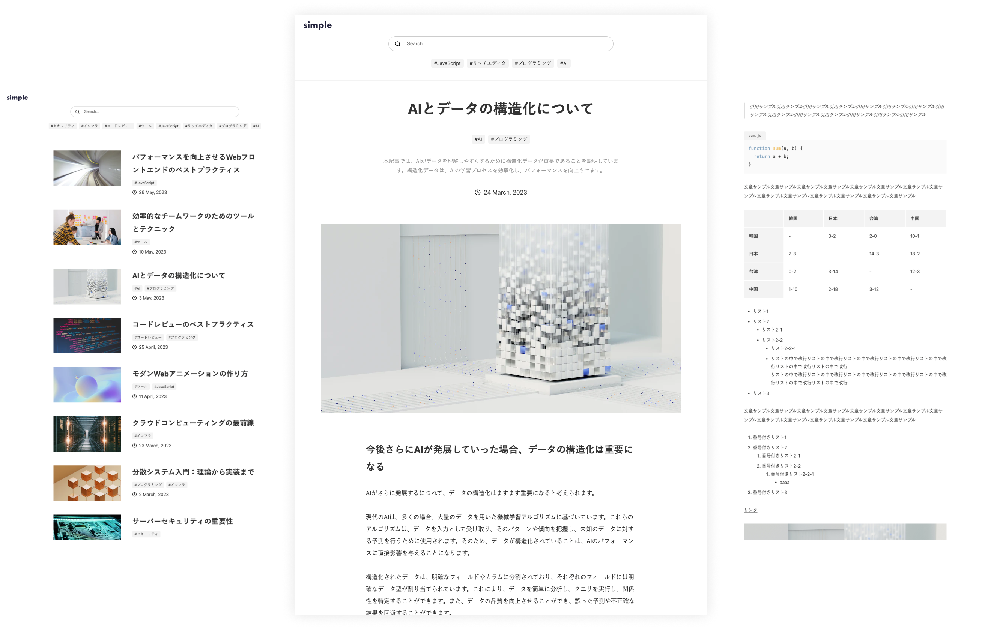

# S1MLOG Frontend



Next.js 16とmicroCMSを使用したブログアプリケーションのフロントエンドです。
各ページは ISR（`revalidate = 60`）で配信され、microCMS の更新は最大60秒で自動反映されます。

## 動作環境

Node.js 20.9 以上

## 環境変数の設定

`.env`ファイルを作成し、下記の情報を入力してください。

```
MICROCMS_API_KEY=xxxxxxxxxx
MICROCMS_SERVICE_DOMAIN=xxxxxxxxxx
NEXT_PUBLIC_SITE_URL=https://www.s1msys.com
BASE_URL=http://localhost:3000
```

`MICROCMS_API_KEY`  
microCMS 管理画面の「サービス設定 > API キー」から確認することができます。

`MICROCMS_SERVICE_DOMAIN`  
microCMS 管理画面の URL（https://xxxxxxxx.microcms.io）の xxxxxxxx の部分です。

`NEXT_PUBLIC_SITE_URL`  
サイトの公開URL。OGP / canonical / sitemap / feed.xml の絶対URLとして使われます。
未設定の場合は `front/constants/index.ts` の `SITE_URL` デフォルト値 `https://www.s1msys.com` にフォールバックします。

例）  
開発環境 → http://localhost:3000  
本番環境（Vercel） → https://www.s1msys.com

`BASE_URL`  
Playwright (E2E) / Jest setup でのみ使用されるベースURL。本番ランタイムには影響しません。

## 開発の仕方

### 1. パッケージのインストール

```bash
npm install
```

### 2. 開発環境の起動

```bash
npm run dev
```

### 3. 開発環境へのアクセス
[http://localhost:3000](http://localhost:3000)にアクセス

## 利用可能なスクリプト

```bash
npm run dev          # 開発サーバーの起動
npm run build        # 本番用ビルド
npm run start        # 本番サーバーの起動
npm run lint         # ESLintの実行
npm run format       # Prettierでのフォーマット
npm run test         # テストの実行
npm run test:watch   # ウォッチモードでテスト
npm run test:coverage # カバレッジレポート付きテスト
```

## Vercelへのデプロイ

### 初回設定

1. Vercelでプロジェクトを作成
2. GitHubリポジトリと連携
3. 以下の設定を行う：
   - **Root Directory**: `front`
   - **Framework Preset**: Next.js
   - **Build Command**: `npm run build`
   - **Output Directory**: 既定のまま（ISR を使うため `out` への静的書き出しはしない）

### 環境変数の設定

Vercelのプロジェクト設定で以下の環境変数を追加：
- `MICROCMS_API_KEY`
- `MICROCMS_SERVICE_DOMAIN`
- `NEXT_PUBLIC_SITE_URL`（本番公開URL）
- （任意）`NEXT_PUBLIC_GA_MEASUREMENT_ID` / `NEXT_PUBLIC_ADSENSE_CLIENT` / `NEXT_PUBLIC_SITE_TWITTER`

> `BASE_URL` は E2E / テストでのみ参照されるため Vercel には不要です。

### 自動デプロイ

GitHubへのpushで自動的にデプロイされます：
- `main`ブランチ → 本番環境
- `develop`ブランチ → プレビュー環境
- Pull Request → プレビュー環境

## プロジェクト構成

```
front/
├── app/                # App Routerのページ
│   ├── articles/       # 記事詳細
│   ├── search/         # 検索（2ページ目以降は /search/p/2?q=keyword）
│   ├── tags/           # タグ別一覧
│   ├── p/              # ページネーション（2ページ目以降）
│   └── api/            # プレビュー用 Route Handler（/api/preview, /api/exit-preview）
├── components/         # Reactコンポーネント
├── libs/              # ユーティリティ
│   ├── microcms.ts    # microCMS API
│   ├── pagination.ts  # ページ数計算・ページ番号バリデーション
│   ├── toc.ts         # 目次生成・本文分割
│   ├── date.ts        # 日付フォーマット
│   └── utils.ts       # リッチテキスト整形（ハイライト・アフィリエイトrel付与）
├── constants/         # 定数
├── public/            # 静的ファイル
└── e2e/               # E2Eテスト
```

## 下書きプレビュー

microCMS の下書きは `/api/preview?contentId=<記事ID>&draftKey=<draftKey>` にアクセスすると確認できます。
draftKey は httpOnly cookie に保存され、URL には残りません。プレビューの終了は `/api/exit-preview` です。

## テスト

### ユニットテスト
```bash
npm test
npm run test:watch
npm run test:coverage
```

### E2Eテスト（Playwright）
```bash
npx playwright install  # 初回のみ
npx playwright test
npx playwright test --ui
```

## 技術スタック

- **Next.js 16** - Reactフレームワーク（App Router / ISR）
- **TypeScript 6** - 型安全性
- **CSS Modules** - スタイリング
- **microCMS SDK** - CMS連携
- **Jest** - ユニットテスト
- **Playwright** - E2Eテスト

## トラブルシューティング

### ビルドエラーが発生する場合

環境変数が正しく設定されているか確認してください。APIキーが無効な場合でもビルドは成功しますが、警告が表示されます。

### 記事が表示されない場合

1. microCMSのAPIキーが有効か確認
2. コンテンツが公開されているか確認
3. APIエンドポイント名が正しいか確認